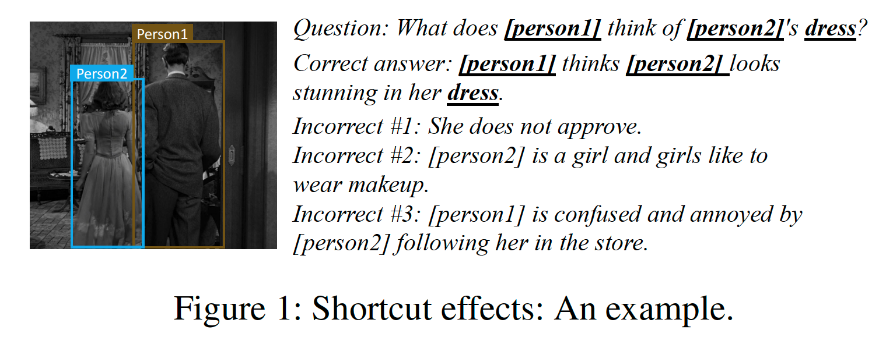
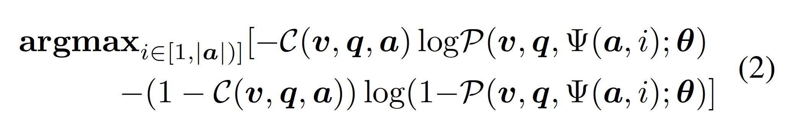
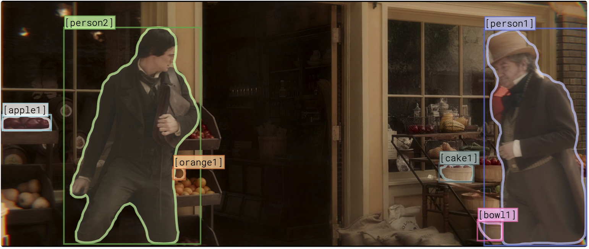
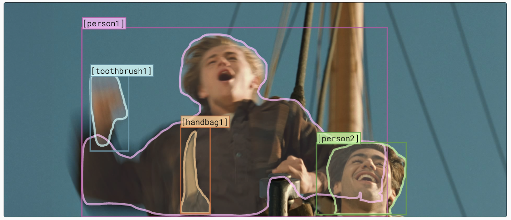
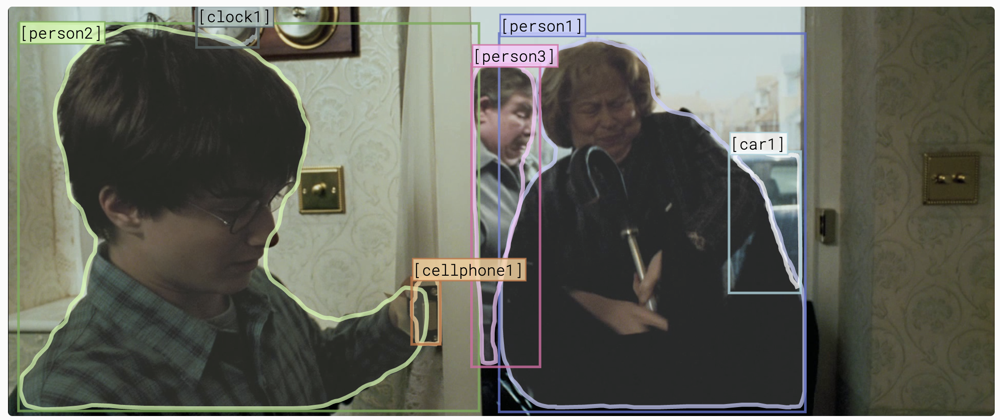
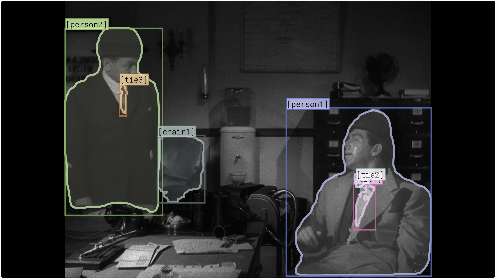
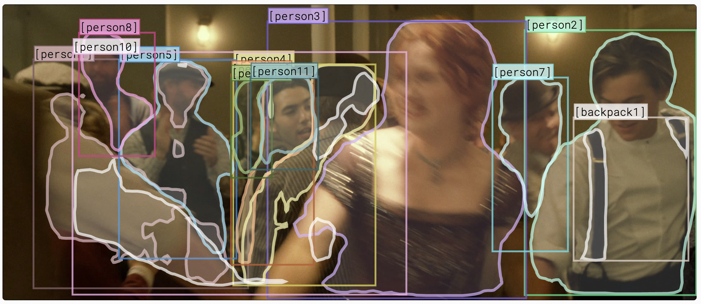
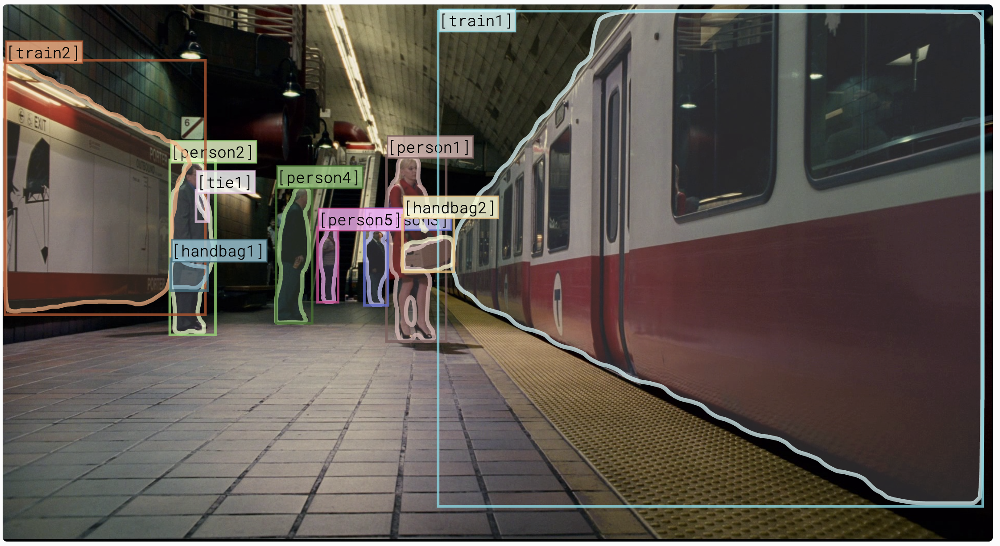

# VCR-shortcut-effects-study

  * [Introduction](introduction)
  * [Prerequisites](#prerequisites)
  * [How simple to beat the random baseline](#how-simple-to-beat-the-random-baseline)
  * [Validation data for verifying the shortcuts](#validation-data-for-verifying-the-shortcuts)
    -  [Rule-based modification](#rule-based-modification)
    -  [Adversarial modification](#adversarial-modification)
       +  [Score the effect of removing tokens](#score-te-effect-of-removing-tokens)
       +  [Generate adversarial settings](#generate-adversarial-settings)
  * [Qualitative examples of the validation data](#qualitative-examples-of-the-validation-data)
  * [Model training](#model-training)
  * [Our paper](#our-paper)

## Introduction
Code and data of our AAAI2021 paper "A Case Study of the Shortcut Effects in Visual Commonsense Reasoning"

## Prerequisites

  * Python 3.6.4
  * Python packages ```pip install -r requirements.txt```
  * Download and unzip the VCR annotations to ```data/vcr1annots```
  * Download and put the VCR images zip file to ```data/vcr1images.zip```

## How simple to beat the random baseline
Please refer to our [cheat.py](tools/cheat.py). 
We count the overlap between the question and answer options and achieved a 29% accuracy (v.s. Random Guess 25%).
Moreover, we found that more than 65% of the correct options have the most overlapped tags.
It means that the connection between the questions and answer options provides a strong hint regarding the correct answer.
Thus, model could find the connection to answer questions, without performing true reasoning.



## Validation data for verifying the shortcuts

We provide the validation data to verify the shortcut effects.
Please refer to the links below to download the data.
The methodology to generate these data are mentioned in our paper section "Methods to Evaluate the Shortcut Effects".
We also provide more details below.

|                       | Setting (link)                                             | Count  | Used in                 |
|-----------------------|------------------------------------------------------------|--------|-------------------------|
| Rule-based Modified   | [Rule-Singular](data/rule_based/val_rule_singular.jsonl)   | 16,154 | Paper Table 3, Row 2    |
|                       | [Rule-Plural](data/rule_based/val_rule_plural.jsonl)       | 3,657  | Paper Table 3, Row 3    |
| Adversarially Modifed | [AdvTop-1](data/adversarial_based/val_adv_rmtop1.jsonl)    | 26,534 | Paper Table 4, Column 4 |
|                       | [KeepTop-1](data/adversarial_based/val_adv_keeptop1.jsonl) | 26,534 | Paper Table 4, Column 5 |
|                       | [KeepTop-3](data/adversarial_based/val_adv_keeptop3.jsonl) | 26,534 | Paper Table 4, Column 6 |
|                       | [KeepTop-5](data/adversarial_based/val_adv_keeptop5.jsonl) | 26,534 | Paper Table 4, Column 7 |

### Rule-based modification

This method targets on how much different methods rely on person tag shortcuts.
Please refer to the code under the "tools" directory for the methods' details. 
[rephrase_choice_singular.py](tools/rephrase_choice_singular.py) and [rephrase_choice_plural.py](tools/rephrase_choice_plural.py) generate the Rule-Singular and Rule-Plural validation data, respectively. To run them, just type ```python rephrase_choice_singular.py``` and ```python rephrase_choice_plural.py``` with default arguments.

### Adversarial modification

This method looks for the token to be masked to maximize the cross-entropy loss.


We use [shortcut_main.py](modeling/shortcut_main.py) to score the effect of removing individual tokens in the answer/rationale.
Then, we use [format_adversarial_annotations.py](tools/format_adversarial_annotations.py) to merge the results from both answering model and rationale model.
Finally, we use [merge_adversarial_annotations.py](tools/merge_adversarial_annotations.py) to generate the setting of AdvTop-1, KeepTop-1, KeepTop-3, KeepTop-5, which are used in our Table 4.

#### Score the effect of removing tokens
We need the answering/rationale models and encoded TF record files to infer the effect of removing individual tokens.
To get the trained models and the TF record files, please refer to [Model training](#model-training).
After training the model, we use the [shortcut_main.py](modeling/shortcut_main.py) to score the effect of removing individual tokens in the answer/rationale.
We provide two example usages here:
```
python tools/shortcut_main.py \
  --logtostderr \
  --model_dir "PATH_TO_ANSWERING_MODEL" \
  --pipeline_proto "PATH_TO_ANSWERING_MODEL/pipeline.pbtxt" \
  --output_jsonl_file "ANSWERING_SCORING.jsonl"
  
python tools/shortcut_main.py \
  --logtostderr \
  --model_dir "PATH_TO_RATIONALE_MODEL" \
  --pipeline_proto "PATH_TO_RATIONALE_MODEL/pipeline.pbtxt" \
  --output_jsonl_file "RATIONALE_SCORING.jsonl" \
  --rationale
```

We then use the [format_adversarial_annotations.py](tools/format_adversarial_annotations.py) to merge the two output jsonl files. Simply run ```python tools/format_adversarial_annotations.py```. We have uploaded the final result scoring file to [data/adversarial_based/shortcut_scores.jsonl](data/adversarial_based/shortcut_scores.jsonl).

#### Generate adversarial settings
Here is an example pipeline to generate [AdvTop-1](data/adversarial_based/val_adv_rmtop1.jsonl) setting.
We assume the original VCR validation data is located at ```data/vcr1annots/val.jsonl``` and the scoring of the shortcut effects is located at [data/adversarial_based/shortcut_scores.jsonl](data/adversarial_based/shortcut_scores.jsonl). The following command shall generate the ```data/adversarial_based/val_adv_rmtop1.jsonl.v2``` file required for the AdvTop-1 setting. The same tool can be used to generate the other adversarial settings, type ```python tools/merge_adversarial_annotations.py --help``` to see all options.

```
python "tools/merge_adversarial_annotations.py" \
  --logtostderr \
  --annotations_jsonl_file "data/vcr1annots/val.jsonl" \
  --adversarial_annotations_jsonl_file "data/adversarial_based/shortcut_scores.jsonl" \
  --output_jsonl_file "data/adversarial_based/val_adv_rmtop1.jsonl.v2" \
  --name "remove_shortcut"
```
## Qualitative examples of the validation data



[val-54] Where is [2] going ?

| original                                                                                                                                                                                      | rule-singular                                                                                                                                                                         | adv-rmtop1                                                                                                                                                                                |
|-----------------------------------------------------------------------------------------------------------------------------------------------------------------------------------------------|---------------------------------------------------------------------------------------------------------------------------------------------------------------------------------------|-------------------------------------------------------------------------------------------------------------------------------------------------------------------------------------------|
| <b>[2] is going into the store . </b></br> [2] is getting into a carriage . </br> [1] is going to the bathroom . </br> [1] is going outside to play after the conversation with [2] is over . | He is going into the store . </br> [2] is getting into a carriage . </br> [2] is going to the bathroom . </br> [1] is going outside to play after the conversation with [2] is over . | [MASK] is going into the store . </br> [2] is getting into a [MASK] . </br> [MASK] is going to the bathroom . </br> [1] is [MASK] outside to play after the conversation with [2] is over |




[val-270] What are [1,2] feeling ?

| original                                                                                                                             | rule-plural                                                                                                                                  | adv-rmtop1                                                                                                                                     |
|--------------------------------------------------------------------------------------------------------------------------------------|----------------------------------------------------------------------------------------------------------------------------------------------|------------------------------------------------------------------------------------------------------------------------------------------------|
| [1,2] do not like the restaurant . </br> They are apprehensive . </br> <b>They are both feeling happy . </b></br> [1,2] are feeling drunk . | [1,2] do not like the restaurant . </br>  [1,2] are apprehensive . </br> They are both feeling happy . </br> [1,2] are feeling drunk . </br> | [1,2] do not like the [MASK] . </br> They are apprehensive [MASK] </br> They are [MASK] feeling happy . </br> [1,2] are feeling [MASK] . </br> |



[val-0] How is [1] feeling ?

| original                                                                                                                                           | rule-singular                                                                                                                              | adv-rmtop1                                                                                                                         |
|----------------------------------------------------------------------------------------------------------------------------------------------------|--------------------------------------------------------------------------------------------------------------------------------------------|------------------------------------------------------------------------------------------------------------------------------------|
| [1] is feeling amused . </br> <b>[1] is upset and disgusted .</b> </br> [1] is feeling very scared . </br> [1] is feeling uncomfortable with [3] . | [1] is feeling amused . </br> He is upset and disgusted . </br> [1] is feeling very scared . </br> [1] is feeling uncomfortable with [3] . | [1] is feeling [MASK] . </br> [MASK] is upset and disgusted . </br> [1] is feeling very [MASK] .  </br>[1] is feeling [MASK] with [3] . |



[val-22] How does [1] feel right now ?

| original                                                                                                                     | rule-singular                                                                                                        | adv-rmtop1                                                                                                               |
|------------------------------------------------------------------------------------------------------------------------------|----------------------------------------------------------------------------------------------------------------------|--------------------------------------------------------------------------------------------------------------------------|
| <b>[1] is tired and concerned . </b></br> [1] feels admonished . </br> [2] is a bit upset . </br> [1] is aroused and happy . | He is tired and concerned . </br> [1] feels admonished . </br> [1] is a bit upset . </br> [1] is aroused and happy . | [MASK] is tired and concerned . </br> [1] feels [MASK] . </br> [MASK] is a bit upset . </br> [1] is aroused and [MASK] . |



[val-171] What do [2,3] appear to be doing ?

| original                                                                                                                                                                             | rule-plural                                                                                                                                                                    | adv-rmtop1                                                                                                                                                              |
|--------------------------------------------------------------------------------------------------------------------------------------------------------------------------------------|--------------------------------------------------------------------------------------------------------------------------------------------------------------------------------|-------------------------------------------------------------------------------------------------------------------------------------------------------------------------|
| [2,3] are opening the ambulance doors to assist someone . </br> <b>[2,3] are dancing .</b> </br> They are working as security for the building . </br> They are hiding among [1,4] . | [2,3] are opening the ambulance doors to assist someone . </br> They are dancing . </br> [2,3] are working as security for the building . </br> [2,3] are hiding among [1,4] . | [2,3] are opening the [MASK] doors to assist someone . </br> [2,3] are [MASK] . </br> They are working as security for the [MASK] . </br> They are [MASK] among [1,4] . |




[val-391] What is [1] planning on doing ?

| original                                                                                                                                                                           | rule-singular                                                                                                                                                                | adv-rmtop1                                                                                                                                                                     |
|------------------------------------------------------------------------------------------------------------------------------------------------------------------------------------|------------------------------------------------------------------------------------------------------------------------------------------------------------------------------|--------------------------------------------------------------------------------------------------------------------------------------------------------------------------------|
| She wants to go to sleep . </br> <b>She is planning to get on [6] . </b></br> [1] is looking to punch [2] in her arm . </br> She is going to play a game with the other children . | [1] wants to go to sleep . </br> She is planning to get on [6] . </br> [1] is looking to punch [2] in her arm . </br> [1] is going to play a game with the other children .  | She wants to go to [MASK] . </br> [MASK] is planning to get on [6] . </br> [1] is looking to [MASK] [2] in her arm . </br> She is going to play a game with the other [MASK] . |

## Model training
tbd...

## Our paper
If you found this repository useful or used our data for evaluation, please cite our paper

```
@InProceedings{Ye_2021_AAAI,
  author = {Ye, Keren and Kovashka, Adriana},
  title = {A Case Study of the Shortcut Effects in Visual Commonsense Reasoning},
  booktitle = {Proceedings of the Thirty-Fifth AAAI Conference on Artificial Intelligence (AAAI)},
  month = {February},
  year = {2021}
}
```
